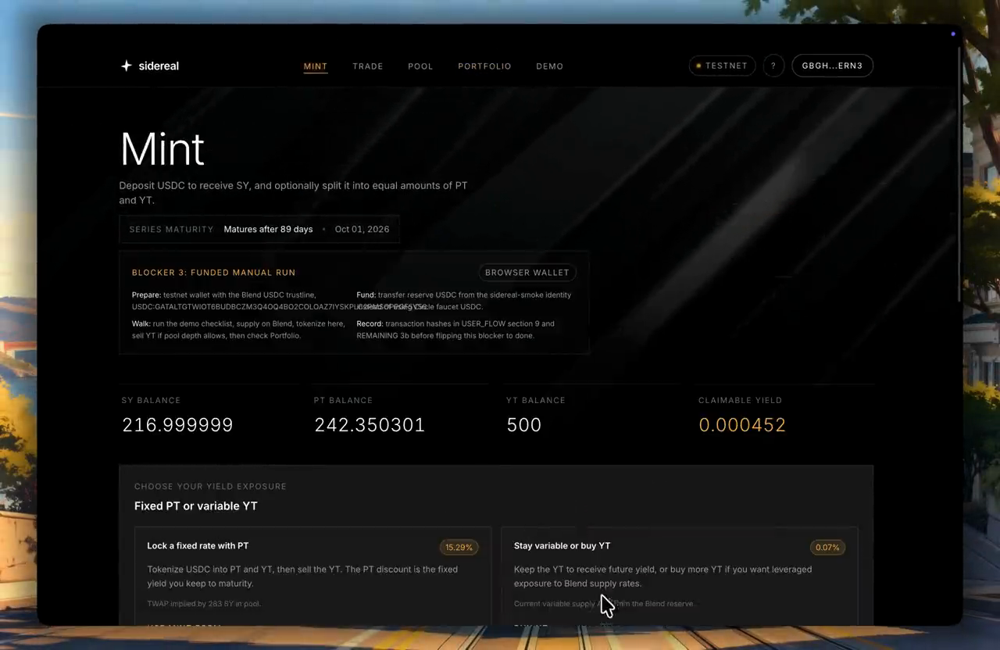

# sidereal

> Yield tokenization for Stellar. Split a yield-bearing position into a principal token and a yield token, trade either, recombine or redeem at maturity.

**Status:** live on Stellar mainnet. Not professionally audited — see [Status](#status).

## Demo

A 90-second walkthrough on testnet: the landing page, the PT + YT = SY invariant, adding liquidity against the live Blend v2 USDC pool, and a transaction building and submitting end to end. Recorded before the mainnet deployment; the mechanics are unchanged.

[](docs/marketing/assets/walkthrough.mp4)

*Click the image to open the video ([direct file](docs/marketing/assets/walkthrough.mp4), 5.8&nbsp;MB).*

---

## What this is

A protocol that takes a yield-bearing asset on Stellar and splits it into two tradable tokens:

- **PT (Principal Token)** redeems for its principal in the underlying at maturity. Buy at a discount, hold to maturity, lock in a fixed yield.
- **YT (Yield Token)** claims all the variable yield the underlying generates between now and maturity, paid out of escrow on claim. Expires worthless at maturity.

`PT + YT = SY` (Standardized Yield) at all times, and you can always recombine. The two tokens, plus SY itself, trade in a single time-decaying AMM modeled on [Pendle V2's market math](https://docs.pendle.finance/ProtocolMechanics/LiquidityEngines/AMM). YT swaps route through the same pool via a flash split/recombine inside the tokenizer, so all three markets share one liquidity book.

## Why Stellar, why now

Stellar's DeFi base has the substrate for a fixed-income market: Blend's USDC pool yields high-single-digit APY on nine figures of TVL, Centrifuge has tokenized treasuries live, and RWA volume is growing quickly. What's missing is the layer that lets holders lock in or hedge that yield, and lets traders take a view on where it's heading. That's this protocol.

## How it works

**SY wrapper.** Deposits USDC into a Blend v2 lending pool and mints SY, a share token. Once Blend custody is active, the exchange rate is read directly from the wrapper's bToken position — there's no admin rate setter.

**Tokenizer.** Splits SY into PT and YT in equal face amounts, recombines them, and pays YT's accrued yield out of an SY escrow. PT redeems for principal at maturity, at a rate frozen to the last observation made at or before maturity — so yield that accrues after maturity never leaks into redemption.

**PT / YT.** Standard SEP-41 tokens with tokenizer-gated mint/burn and per-holder yield checkpoints.

**AMM.** One pool prices PT, SY, and YT together, using an integer fixed-point reimplementation of Pendle V2's time-decaying curve (Soroban's wasm target rejects float opcodes, so this can't be the floating-point original).

See [`ARCHITECTURE.md`](./ARCHITECTURE.md) for the full design and the Soroban-specific decisions behind it, and [`docs/SETTLEMENT.md`](./docs/SETTLEMENT.md) for the settlement model.

```
                 User
                  | deposit underlying
                  v
          SY Wrapper / Vault   (real SEP-41 underlying in, SY shares out)
                  | mint SY
                  v
              Tokenizer        (custodies SY, drives PT/YT)
               /        \
              v          v
          PT Token    YT Token
              |           |
           Redeem      Claim yield
        (1:1 at maturity)  (variable, reads real YT balance)

  Trades against a shared liquidity book:
          PT/SY AMM  --  YT flash route (split/recombine via tokenizer)
```

---

## Deployed contracts

### Mainnet

Deployed 2026-07-11 from commit `67151f8a35a9684f89bef1ade915e850d23b5163` against Blend v2's `FixedV2` USDC pool. Manifest with wasm-hash-vs-on-chain-hash verification: [`deployments/mainnet.toml`](./deployments/mainnet.toml). Parameter selection record: [`docs/deploy/MAINNET_PARAMETERS.md`](./docs/deploy/MAINNET_PARAMETERS.md). App: [sidereal.tech](https://www.sidereal.tech).

| Component | Contract ID |
|---|---|
| USDC (Circle) | [`CCW67TSZV3SSS2HXMBQ5JFGCKJNXKZM7UQUWUZPUTHXSTZLEO7SJMI75`](https://stellar.expert/explorer/public/contract/CCW67TSZV3SSS2HXMBQ5JFGCKJNXKZM7UQUWUZPUTHXSTZLEO7SJMI75) |
| SY wrapper | [`CCLFK26PU5GNMCUAGBBBGKVXE6GWYA2PB3RFTC7Y5HRVPPBRGWYUZKUU`](https://stellar.expert/explorer/public/contract/CCLFK26PU5GNMCUAGBBBGKVXE6GWYA2PB3RFTC7Y5HRVPPBRGWYUZKUU) |
| PT token | [`CDZ2M6DWIVY6KFJSFEA5KWIDQUDEGFEDQ5XMJPITAVBYLNGFEYLBRMSX`](https://stellar.expert/explorer/public/contract/CDZ2M6DWIVY6KFJSFEA5KWIDQUDEGFEDQ5XMJPITAVBYLNGFEYLBRMSX) |
| YT token | [`CDJIC6JKQ7J5G3KUNRPFXQYNFWVTADCDFWHROSMCI36TVN2ATGIIYFRJ`](https://stellar.expert/explorer/public/contract/CDJIC6JKQ7J5G3KUNRPFXQYNFWVTADCDFWHROSMCI36TVN2ATGIIYFRJ) |
| Tokenizer | [`CBMB52N4XDAFRQRQ4MYGRPFUS3DDREWYY45VWWXEJSPITE5XH7DXEHBX`](https://stellar.expert/explorer/public/contract/CBMB52N4XDAFRQRQ4MYGRPFUS3DDREWYY45VWWXEJSPITE5XH7DXEHBX) |
| PT/SY AMM | [`CDA4HVNGSQ52DCGRYQIE5JKSNWCFTH4FEANHPLWB2U32EXGP36DGZVJK`](https://stellar.expert/explorer/public/contract/CDA4HVNGSQ52DCGRYQIE5JKSNWCFTH4FEANHPLWB2U32EXGP36DGZVJK) |
| Blend v2 `FixedV2` pool | [`CAJJZSGMMM3PD7N33TAPHGBUGTB43OC73HVIK2L2G6BNGGGYOSSYBXBD`](https://stellar.expert/explorer/public/contract/CAJJZSGMMM3PD7N33TAPHGBUGTB43OC73HVIK2L2G6BNGGGYOSSYBXBD) |

Admin is a single key, not a multisig. Its only post-deploy power is a constrained reserve-index migration that can re-point the wrapper at the same underlying asset under a new Blend reserve slot — it can't redirect funds, reprice, or mint. Rationale in `docs/deploy/MAINNET_PARAMETERS.md`.

### Testnet

Generated by [`deployments/testnet.toml`](./deployments/testnet.toml), deployed 2026-07-10 from commit `fa2deb7a375f2b5c2c95aadf3626e5b470b5dfcf` against Blend v2's testnet USDC pool. A later redeploy from the commit that shipped to mainnet also exists at [`deployments/testnet-67151f8.toml`](./deployments/testnet-67151f8.toml). Used for development; not canonical once mainnet is live.

---

## Local development

Prerequisites:

```bash
# Rust toolchain and the Soroban wasm target (SDK 26 needs wasm32v1-none)
curl --proto '=https' --tlsv1.2 -sSf https://sh.rustup.rs | sh
rustup target add wasm32v1-none

# Stellar CLI (only needed to deploy)
cargo install --locked stellar-cli

# Node and pnpm
nvm install 20
npm install -g pnpm
```

Clone, build, and test the whole monorepo with the Makefile:

```bash
git clone https://github.com/PoulavBhowmick03/sidereal
cd sidereal

make install   # install JS workspace deps
make test      # contracts + SDK + app test suites
make build     # wasm contracts, SDK, and a production app build
make dev       # run the frontend dev server
```

Deploy to testnet and wire the frontend:

```bash
make deploy    # or: bash scripts/deploy-testnet-resilient.sh
```

This builds the contracts to wasm, generates and funds a deployer identity (no hardcoded keys), deploys SY/PT/YT/tokenizer/AMM, initializes them in dependency order, writes the contract addresses to `app/.env.local`, and emits a public deployment manifest at `deployments/testnet.toml`. For the mainnet deploy process — clean tagged commit, reproducible build, provenance manifest, parameter selection — see [`docs/deploy/PROVENANCE.md`](./docs/deploy/PROVENANCE.md) and [`docs/deploy/MAINNET_PARAMETERS.md`](./docs/deploy/MAINNET_PARAMETERS.md).

## Deploying the frontend (Vercel)

Set the Vercel project's Root Directory to `app` (Settings > General > Root Directory). Vercel then detects Next.js and reads `app/vercel.json`, which builds the workspace SDK before the app (`pnpm --filter @sidereal/sdk build && next build`). The install runs at the pnpm workspace root automatically, so `@sidereal/sdk` resolves. Use Node 20+.

Set the contract addresses as environment variables (all public `NEXT_PUBLIC_*`, no secrets); see `app/.env.example` for the full list. Without them the site builds and runs but shows a "no market configured" banner.

## Testing

```bash
make contracts-test   # cargo test --workspace
make sdk-test         # SDK typecheck + vitest
make app-test         # app typecheck + vitest
```

The AMM has property tests verifying `PT + YT = SY` across random swap sequences, and the economics suite runs a 10,000-case conservation property test over random split/transfer/claim/recombine/redeem sequences with rate changes. These run on the native target. Because the AMM curve math compiles differently for native than for the wasm VM (which rejects float opcodes), CI also builds every contract to `wasm32v1-none` and fails on any float opcode (`scripts/check-wasm-floats.sh`) — that guard, not the property tests, is what catches a float regression before it reaches a deploy. CI (`.github/workflows/ci.yml`) runs all three layers on every PR.

## Status

Live on Stellar mainnet since 2026-07-11, alongside testnet. The full lifecycle — deposit, split, recombine, redeem, claim yield, AMM swaps, and the YT flash route — settles real SEP-41 tokens and has been run end to end with real funds on mainnet.

This has not had a professional third-party audit. The contracts are immutable, with no upgrade path, so a defect would be permanent. The mainnet deployment holds small, deliberately limited funds — treat it as early and unaudited, not as safe.

Known issues, all minor and none fund-affecting, are tracked in [`findings.md`](./findings.md). `AUDIT.md` and [`docs/ROADMAP.md`](./docs/ROADMAP.md) describe an earlier pre-mainnet state and are kept for history only.

## Contributing

The repo is public from day one and we welcome external eyes.

- Keep PRs focused and include tests for user-visible or contract behavior changes.
- Open an issue before a large PR — scope is tight while the protocol is early and unaudited.
- Report security findings privately via GitHub's "Report a vulnerability" (Security tab), not as a public issue. See [`SECURITY.md`](./SECURITY.md).

## Influences and prior art

- [Pendle V2](https://docs.pendle.finance/) — the canonical yield tokenization protocol, and the design this adapts.
- [Spectra](https://docs.spectra.finance/) — EVM yield tokenization on ERC-4626. Their permissionless-pool experience informed launching with curated pools first.
- [Notional Finance](https://docs.notional.finance/) — the AMM math root.
- [OpenZeppelin Soroban](https://docs.openzeppelin.com/stellar-contracts/) — the Vault extension the SY wrapper builds on.

## License

Apache-2.0. See [`LICENSE`](./LICENSE).

## Acknowledgments

Built during the [Stellar Build Station Kolkata 2026](https://stellar.org/) sprint. Thanks to the SCF team, OpenZeppelin's Stellar group, and the Blend, Centrifuge, and Aquarius teams whose work this builds on.
